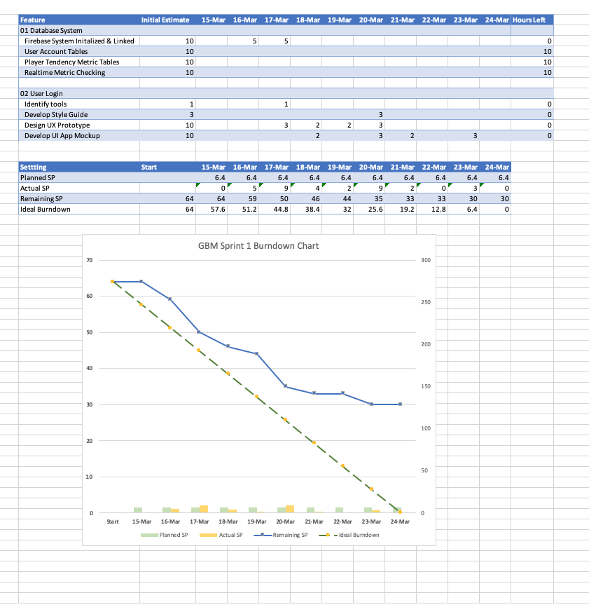
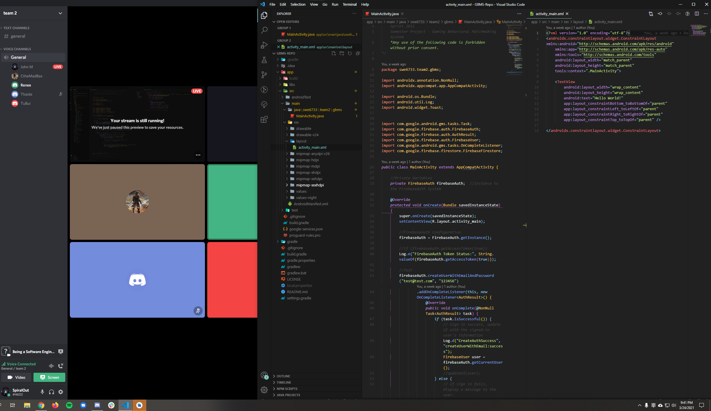

**Sprint Forecast**   
- The group decided to accomplish 100 Story Points (SP) during the first sprint. The breakdown was _01 Database System_ (40 SP) and _02 User Login_ (60 SP) during the first sprint.   
- These two backlog items were deemed foundational to the entire system. Without first completing these two backlog items, it would be challenging to start other backlog items. Misunderstandings of the magnitude of the two backlog items required some modifications to the forecast, such as 02 User Login requiring additional tasks than what was originally listed. As such, the number of SP for 02 User Login was reduced to 24/60 SP.

**Sprint Burndown Chart**
https://drive.google.com/file/d/1CEwohgwsDVP8Dm7Om7Apzbpjd0I1U9fn/view?usp=sharing

**Sprint Documentations** _(includes Daily Scrums & Sprint Reviews)_
https://docs.google.com/document/d/1FUdENHy-KZ_gGeMFI8PQRvV-3Bd1DbDnW34GJ9jFz_A/edit?usp=sharing

**Evidence of Mob/Paired Code**

**App UI Prototype**

https://youtu.be/2rPzzUZeX5M
_Also Included in the same folder._

**Evidence of Testing**
- Project is not at the testing phase. Initialized database and created a high level prototype. The code to integrate the database and systems begins in Sprint 2. Therefore, there is no code to review for the creation of Test Suites. In addition, the UI App Mockup provides a preview of how the app is intended to work/look once fully functional and does not require Test Suites.